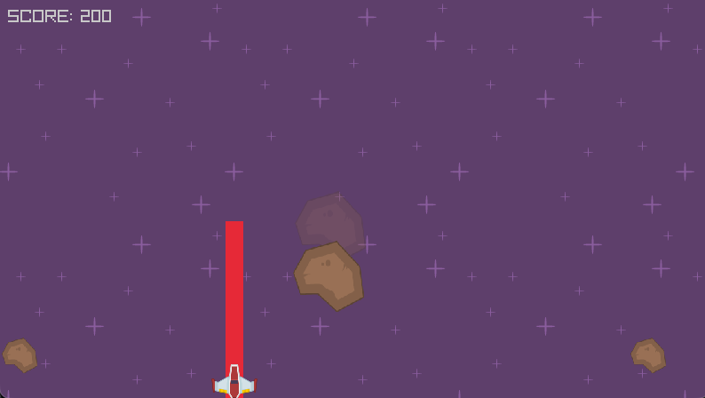
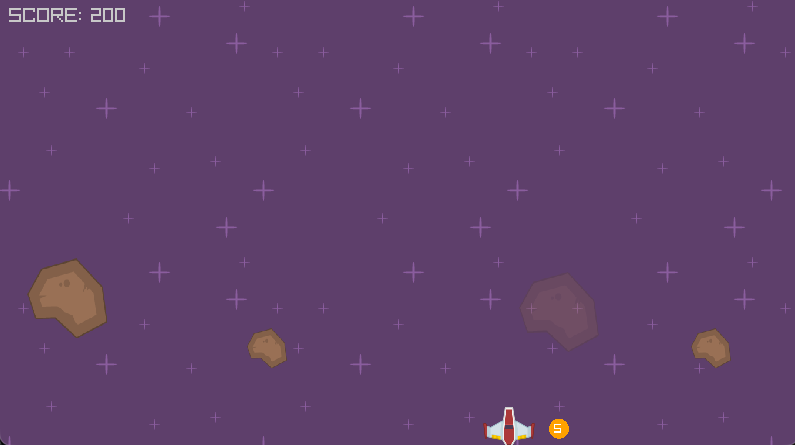
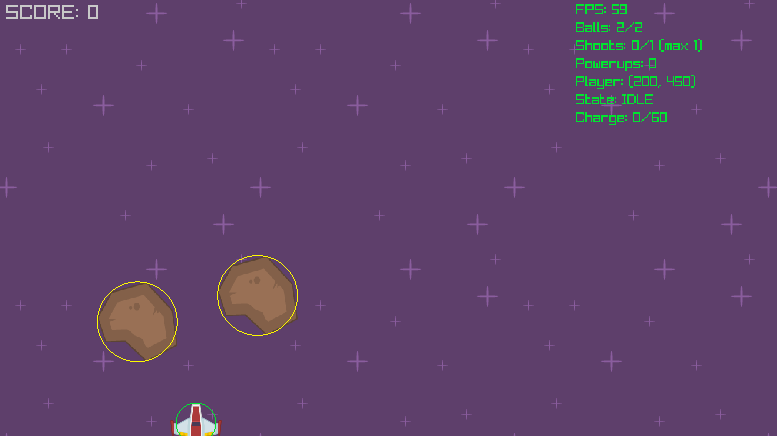

# Space PANG

A space-themed reimplementation of the classic PANG (Buster Bros) arcade game, built with Python and [Pyray](https://github.com/electronstudio/raylib-python-cffi).

## Video Link

[Google Drive Link](https://drive.google.com/file/d/11yzbYCYpWPzXKDKSg1PcnPRZA3-sH3U6/view?usp=sharing)

## Game Description

The player controls a spaceship at the bottom of the screen, firing beams upward to destroy bouncing meteors. When a meteor is hit, it splits into two smaller, faster meteors. The goal is to destroy all meteors without getting hit.

Charging a beam makes it wider but also makes the ship visually damaged(no actually penalties, but makes it visually more dynamic). Powerups dropped from destroyed meteors grant additional angled beams that fire simultaneously.

Based on the [C/Raylib PANG](https://github.com/raysan5/raylib-games/blob/master/classics/src/pang.c) by Ramon Santamaria.

## Key Features

### Charged Shoot

Holding Space charges a wider beam. The ship switches to its damaged sprite during charge to communicate the energy drain.
There are no actual penalties, but changing its appearance makes the game visually more interesting. 
Releasing the spacebar fires all available beams at once. Quickly pressing and releasing the spacebar fires a thin beam.

### Meteor Split

Big meteors split into two medium, medium into two small, and small ones pop. Each size has different bounce height and speed. Splitting creates progressively harder situations as the screen fills with faster meteors.

### Powerups

Splitting a meteor has a 40% chance to drop a powerup. Picking one up adds an extra beam at a 30-degree angle (left first, then right).

### Sprite Animation

The ship uses a 4-frame sprite sheet with states for idle, banking left, banking right, and damaged (charging). The current state selects the appropriate frame each tick.

### Title, Pause & Debug

Title screen on launch. 

Press P to pause and view controls/instructions

Press D to toggle debug mode

## Screenshots

| Title | Gameplay |
|-------|----------|
|  |  |

| Pause/Instructions | Game Over |
|--------------------|-----------|
|  |  |

## List of Resources Used

**Art:** 
- [Kenney.nl Space Shooter Art](https://opengameart.org/content/space-shooter-art): Ship sprites, meteor sprites, star background. Medium meteor scaled from big with **Excalidraw**. Sprite sheet assembled from individual frames with **Excalidraw**.

**Sounds from [Pixabay](https://pixabay.com/)** (Pixabay Content License):
- Shoot sound (`shoot.mp3`) by ahmed_abdulaal
- Win sound (`win.mp3`) by freesound_community
- Lose sound (`lose.wav`)
- Meteor split sound (`split.mp3`)

**AI Generated sounds**:
- Pickup sound (`pickup.wav`)
- Background music (`space_bgm.wav`)

**Tools:** [VLC](https://www.videolan.org/) (audio editing/conversion), [ExcaliDraw](https://excalidraw.com/) (sprite sheet assembly), [uv](https://github.com/astral-sh/uv) (package management)

**Frameworks:** [Raylib](https://www.raylib.com/) + [Pyray](https://github.com/electronstudio/raylib-python-cffi)

**Reference:** [Original PANG in C/Raylib](https://github.com/raysan5/raylib-games/blob/master/classics/src/pang.c) by Ramon Santamaria