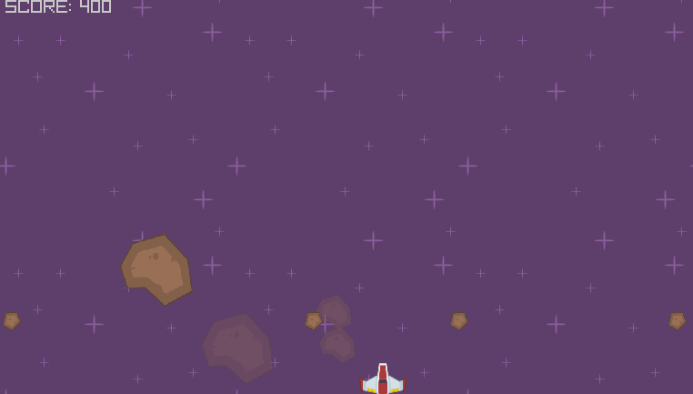
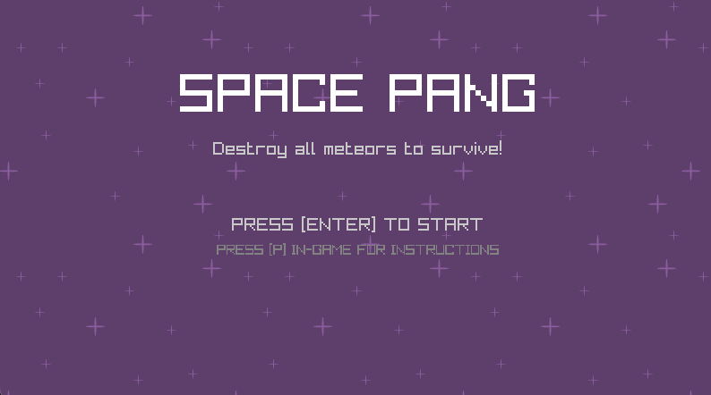
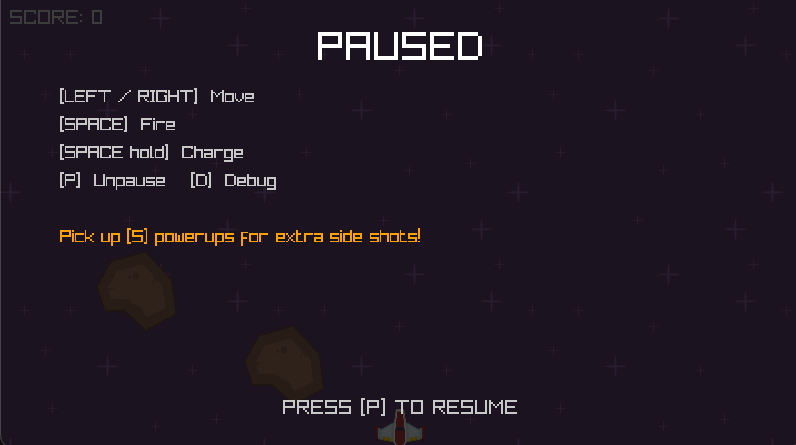
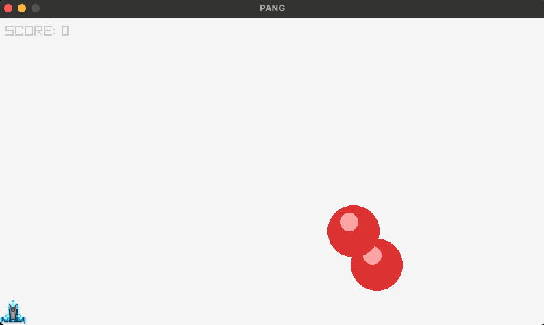
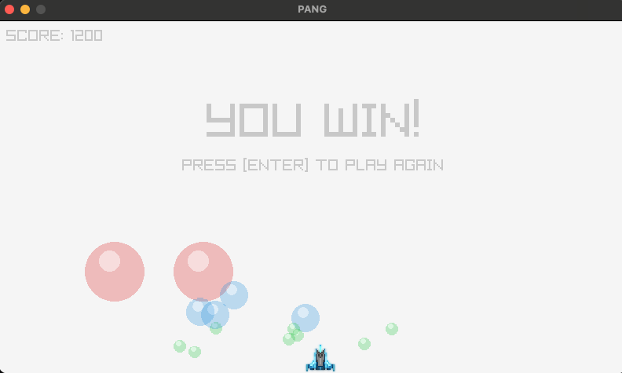
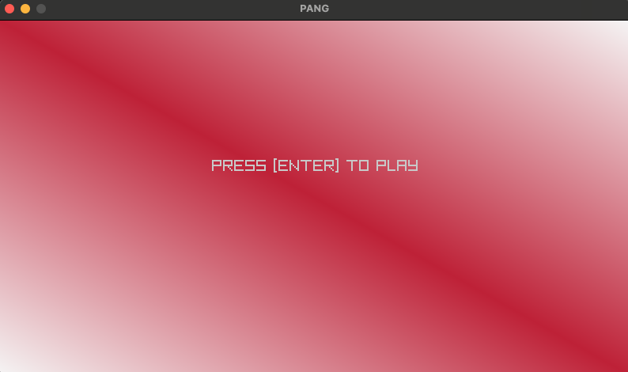
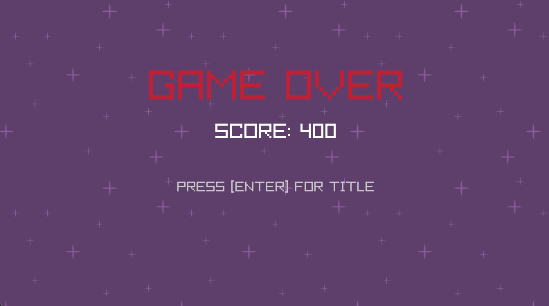

# Space PANG

A space-themed twist on the classic PANG (Buster Bros) arcade game, built with Python and [Pyray](https://github.com/electronstudio/raylib-python-cffi).

## Game Description

Pilot a spaceship. Blast bouncing meteors. Don't get hit.

Meteors bounce around the screen under gravity. You fire beams upward to destroy them -- but every hit splits a meteor into two smaller, faster ones. Your job is to destroy every last fragment without getting crushed.

The twist? You can hold Space to charge a wider beam, but charging drains your ship's energy -- it visibly weakens, leaving you exposed. Pick up powerups from destroyed meteors to unlock angled side-shots that fire simultaneously with your main beam.

Based on the [C/Raylib PANG](https://github.com/raysan5/raylib-games/blob/master/classics/src/pang.c) by Ramon Santamaria.

## Key Features

### Charged Shoot

Hold Space to charge up a wider beam. The longer you hold, the bigger the blast -- but your ship switches to its damaged state while charging, showing it's diverting all energy to weapons. Do you play it safe with quick taps, or risk a big charge to clear a tight cluster?

### Meteor Split

Big meteors split into two medium ones, medium into two small, and small ones just pop. Each size bounces differently -- smaller fragments are faster and harder to dodge. One careless shot can turn a manageable screen into chaos.

### Powerups

Destroying meteors has a chance to drop a powerup. Grab it and you get an extra beam that fires at an angle -- left side first, then right. All your beams fire at the same time, so stacking powerups turns you into a spread-shot machine.

### Sprite Animation

The ship tilts when you move and looks visibly damaged while charging. It's a small touch but it makes the ship feel alive -- you can tell what's happening at a glance.

### Title, Pause & Debug

A proper title screen greets you on launch. Press P anytime to pause and see the controls. Press D for debug mode -- hitboxes, velocity vectors, and live stats overlay the game. Handy for understanding (or showing off) the collision and physics systems.

## Screenshots

### Before (Original PANG)

| Gameplay | Win | Game Over |
|----------|-----|-----------|
|  |  |  |

### After (Space PANG)

| Title | Gameplay | Pause/Instructions | Game Over |
|-------|----------|--------------------|-----------|
|  |  |  |  |

## List of Resources Used

**Art:** [Kenney.nl Space Shooter Art](https://opengameart.org/content/space-shooter-art) (CC0) -- ship sprites, meteor sprites, star background. Medium meteor scaled from big with Python Pillow. Sprite sheet assembled from individual frames with Pillow.

**Sounds from [Pixabay](https://pixabay.com/)** (Pixabay Content License):
- Shoot sound (`shoot.mp3`) -- by ahmed_abdulaal
- Win sound (`win.mp3`) -- by freesound_community
- Lose sound (`lose.wav`)
- Meteor split sound (`split.mp3`)

**Generated sounds** (Python `wave` + `math` modules):
- Pickup sound (`pickup.wav`) -- ascending sine tone
- Background music (`space_bgm.wav`) -- chiptune in C minor at 140 BPM

**Tools:** VLC (audio editing/conversion), [Pillow](https://pillow.readthedocs.io/) (sprite sheet assembly), [uv](https://github.com/astral-sh/uv) (package management)

**Frameworks:** [Raylib](https://www.raylib.com/) + [Pyray](https://github.com/electronstudio/raylib-python-cffi)

**Reference:** [Original PANG in C/Raylib](https://github.com/raysan5/raylib-games/blob/master/classics/src/pang.c) by Ramon Santamaria

## Bonus: If I Had More Time

- **Slow-motion charging:** Slow down game time while charging -- meteors drift, tension builds, and the energy drain narrative hits harder.
- **Multiple levels:** More meteors, faster speeds, maybe different meteor types with unique split patterns.
- **Ship upgrades:** Persistent upgrades between rounds -- shield recharge, charge speed, beam customization.
- **Particle effects:** Explosions on meteor kills, thruster flames, spark trails on beams.
- **Leaderboard:** Local high score table with initials, arcade-style.
